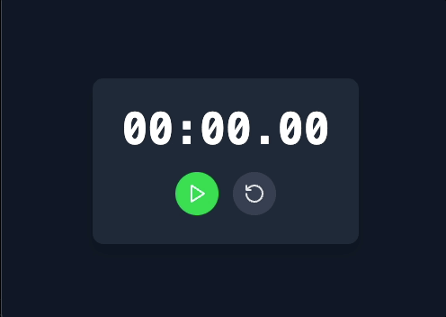

# (미션) StopWatch

## 개요

이 미션에서는 **리액트의 `useEffect` 훅**을 활용하여, 타이머가 0.01초씩 증가하는 **StopWatch**를 구현합니다.  
앱은 **StopWatch 컴포넌트**로 구성되며, 시작 버튼을 클릭하면 초가 0.01초 단위로 증가, 일시중지 버튼을 누르면 타이머 중지, 리셋 버튼을 누르면 다시 0초로 리셋되는 애플리케이션을 만들어주세요.

---

## 요구사항

### 1. 참고 코드

- 미션에 기반이되는 StopWatch 컴포넌트는 미리 제공됩니다.
- 간단한 스타일도 처리가 되어 있습니다.(Tailwind CSS)
- 주어진 컴포넌트에 작성된 요소들을 요구사항에 맞게 제어하는 미션입니다.

### 2. 기능 구현하기

- `재생`: 재생 버튼을 클릭하면 타이머가 시작됩니다. (0.01초씩 증가)
- `일시중지`: 일시 중지 버튼을 클릭하면 타이머가 중지됩니다.
- `리셋`: 리셋 버튼을 클릭하면 타이머가 초기화됩니다.

### 3. 구현 모습

- 마우스를 클릭할 때 생기는 검은색 동그라미 원은 캡쳐 프로그램 효과입니다. (구현 대상에서 제외입니다.)

---

## 해결 목표

1. **useEfffect 훅 이해하기**

   - useEffect 훅을 활용하는 방법을 배웁니다.

---
